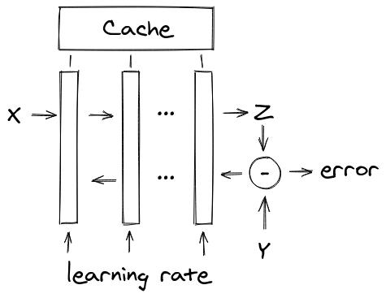
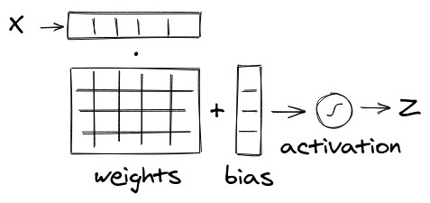

# nanonn

NanoNN is a nano-framework for neural networks. Or, if you wish, a collection of toy neural network implementations in different programming languages.

In no sense it is a replacement for Tensorflow or PyTorch, but you might find this project useful for hobby projects, embedded systems and for didactic purposes. Nothing teaches better than a toy code one can play with.

# Features

* Sequential feed-forward neural networks.
* Fully-connected dense layers.
* Various activation functions: sigmoid, SoftMax, ReLU, leaky ReLU and linear, optional bias, customizable cost function.
* Weights and biases of each layer can be imported from outside, i.e. from a trained Tensorflow model.
* Other layer types can be implemented and plugged in.
* Full code is around 100-200 lines of code. In five minutes you can read it all.
* Implementations available in many popular programming languages.
* Zero dependencies. Seriously, very lightweight.
* Comes with tests, benchmarks and examples.

Here's for example an [MNIST demo in JavaScript](https://zserge.com/nanonn/js/mnist.html) to show you what NanoNN can do.

## Implementations

* [C](c), good old C89, no memory allocations, vectorization where possible.
* [JavaScript](js), ES6, less than 1KB minified and gzipped, your browser won't even notice.
* [Go](go), straight and to the point.
* [Python](python), it's math after all. No numpy knowledge is required.
* [Kotlin](kotlin), because Android. Thanks to [@krugloid](https://github.com/krugloid)
* Java, the most boring one. Coming soon.
* Swift, at least it's not Objective-C. Coming soon.
* Rust, because WebAssembly. Help wanted.

## Neural networks

Neural network (NN) is a technique for building a computer program that learns from data. It is loosely based on how the human brain works, but under the hood it's all about adding/multiplying arrays of numbers.

NanoNN implements a sequential NN model, which is a linear list of layers of neurons:

Layers are tall rectangles. The way how NanoNN network works, is that it passes input vector `X` to the first layer, the resulting output vector is passed to the second layer as an input and so on. The output of the last layer is the result vector `Z`, or the "prediction" of the network. This mode is called "forward propagation", or "prediction mode", because the network predicts the output by the given input. How exactly the layers transform the input vector into the output one depends on the type of the layer and its parameters.

To train the NanoNN model, one must also provide the expected output vector `Y`. NanoNN applies the _cost function_ to estimate how wrong the network was it its prediction, and passes this error vector to the last layer. The layer fixes itself, and passes an error vector to the previous one, and so on up to the first layer. The model can control how radical these "fixes" are by adjusting the _learning rate_ parameter.

Yes, that's the whole architecture of NanoNN. One last thing to mention is that layers can store their internal data in network cache, if they want other layers to access it. Of course, different implementations are free to store internal layer state within the layer data type/class as well.

## Layers

Layers transform input vector into the output vector and adjust their parameters during training (_backpropagation_):

The essense of the layer if a weight matrix, which defines how to multiply input vector to get the output. In the picture above the layer has 4 units (neurons) and 5 inputs. This, the weight matrix is 5x4=20 elements. Most implementations store weight matrix as a linear array for simplify.

Apart from the weights, each unit has a bias value, which is added to the resulting dot product of the input vector `X` to the weight matrix `W`. Bias is completely optional, but often useful.

The resulting vector is then passed through some activation function, which transform it into a non-linear space. A well-known book example of the activation function is sigmoid (`1/(1+e^x)`). But also, ReLU is quite popular due to its simplicity. NanoNN comes with a whole range of activation functions. Linear activation function does not transform anything at all, and it can be used to inject custom activation functions as separate layers.

Training a layer requires taking an error vector and adjusting the weights depending on how big is the error and what the input related to that weight was. The details of the backpropagation algorithm can be found in the concrete implementations.

So, yes, the only layer comping out box is a fully connected Dense layer, with optional bias and dropout, but layer is often an abstract type (interface), so their implementations are up to you, if you need them. You may not implement backwards propagation if you don't expect your network to be trained.

## Contributing

Pull requests are welcome. For new features or major changes, please open an issue first to discuss what you would like to change. Implementations if other programming languages are always welcome! 

## License

[Apache License 2.0](https://choosealicense.com/licenses/apache-2.0/)
